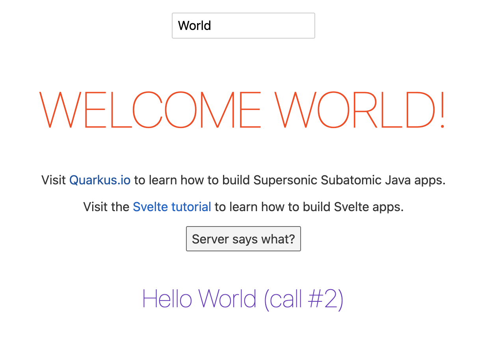

# Sveltesse : Quarkus + Svelte demo

This is a sample project using [Quarkus](https://quarkus.io/), the Supersonic Subatomic Java Framework with a [Svelte JS](https://svelte.dev/) frontend (in Typescript).

## Running the application in dev mode in VS Code
Start by running the build task (Shift+Ctrl+B or Shift+Cmd+B on Mac), to watch `.svelte` file changes and recompile them on the fly. Compiled javascript and css files are copied to `src/main/resources/META-INF/resources/build`, where Quarkus serves static files from.

Launch `Debug Quarkus Application` from the debug view and open http://localhost:8080/

Tadaaa!!!

Svelte files in `src/main/svelte` will be recompiled on save. If your browser is equipped with a [LiveReload](http://livereload.com/) plugin, the main page will refresh automagically.

Regular Quarkus dev mode experience applies. Any changes to the backend will be refreshed on the next HTTP request.

Once I figure out how to make a proper problem matcher for the `svelte:watch` task (in `.vscode/tasks.json`), it'll be triggered automatically along with the debugger. 

## License

Apache License 2.0. See [LICENSE](LICENSE) file.

